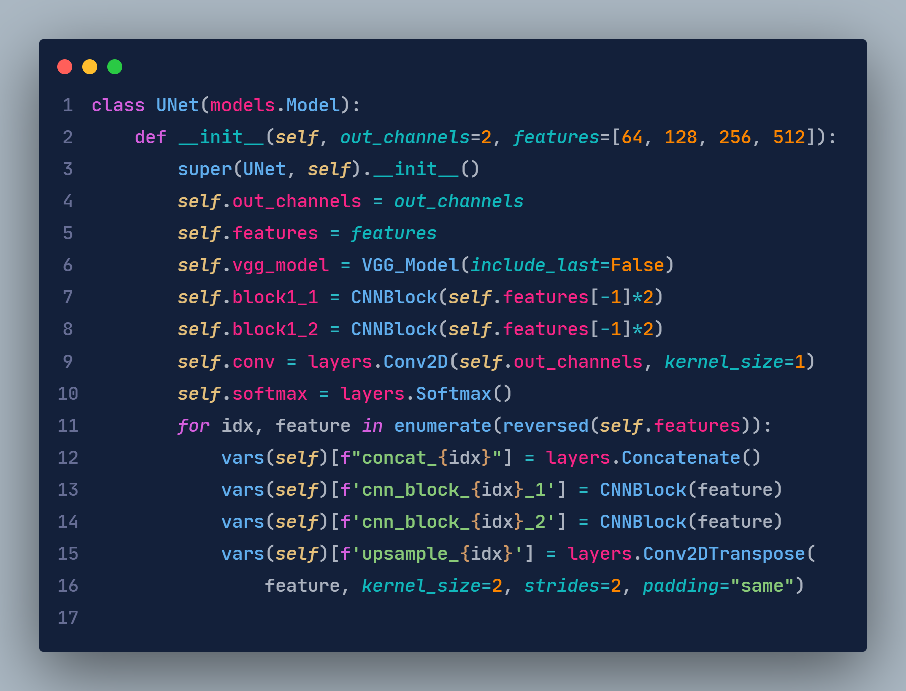
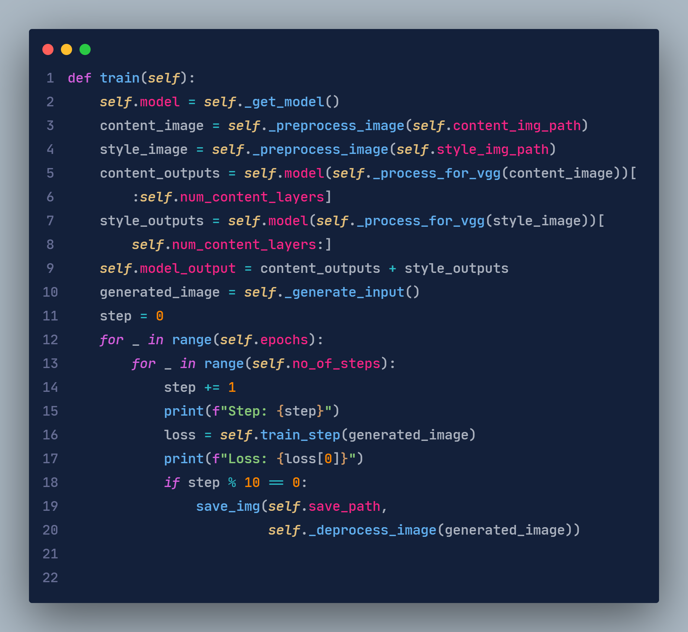

# Python-One-Dark
This theme works best only in python. I made this theme for my personal use, but anyone can use it.

## Preview
### Python Class


### Python Functions



## Suggested Editor Settings
```
 "editor.fontSize": 17,
 "editor.fontWeight": 500,
 "editor.lineHeight": 32,
 "editor.fontFamily": "JetBrains Mono",
```
JetBrains Mono Download: [https://www.jetbrains.com/lp/mono](https://www.jetbrains.com/lp/mono)

## Go Back to Previous Version 
**If you didn't like the current Title and Sidebar Colors You can activate previous colors using this settings**
```
"workbench.colorCustomizations": {
        "activityBar.background": "#40008a",
        "menu.background": "#0e1a30",
        "menu.foreground": "#abb2bf",
        "menu.selectionBackground": "#0e012c",
        "menu.separatorBackground": "#343a45",
        "menubar.selectionBackground": "#4c2894",
        "menubar.selectionForeground": "#f0f0f0"
        
    },

```

## Find me
Check out my other projects at:
[Portfolio Website](https://bimaltimilsina.com.np) |
[GitHub](https://github.com/TimilsinaBimal/)
## Updates

You may get updates, but not guaranteed!

**Enjoy!**
